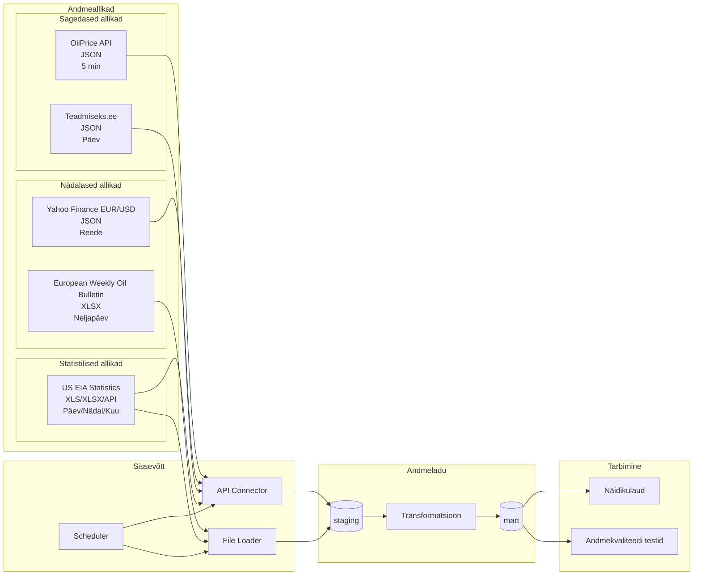

# Kütuseanalüüs — Maailmaturu ja Eesti kütusehindade võrdlev analüüs

## Äriküsimus

Kui kiiresti ja võrdselt kanduvad bensiini/diisli hinnamuutused üle Baltikumi tankla hindadesse ning milline riik pakub igal nädalal odavaima kütuse?

**Mõõdikud:**

1. Maailma bensiini ja Eesti, Läti, Leedu hinnavõrdlus nädala lõikes
2. Maailma diisli ja Eesti, Läti, Leedu hinnavõrdlus nädala lõikes

## Arhitektuur



Täpsem kirjeldus: [`docs/arhitektuur.md`](docs/arhitektuur.md)

## Andmestik

| Allikas | Tüüp | Ajas muutuv? | Roll | Link |
|---------|------|--------------|------|------|
| European Weekly Oil Bulletin | xlsx | Kord nädalas (neljapäevit) | Baltikumide hinnad | https://energy.ec.europa.eu/document/download/906e60ca-8b6a-44e7-8589-652854d2fd3f_en?filename=Weekly_Oil_Bulletin_Prices_History_maticni_4web.xlsx |
| Oil Price | JSON | 5 minutit | Maailma hinnad | https://www.oilpriceapi.com |
| US Statistics | XLS | Päevas/nädalas/kuus | Maailma/USA hinnad | https://www.eia.gov/opendata/, https://www.eia.gov/dnav/pet/pet_pri_spt_s1_w.htm, https://www.eia.gov/dnav/pet/xls/PET_PRI_SPT_S1_W.xls |
| Yahoo Finance | JSON | Kord nädalas (reede) | Euro ja dollari kurss | https://query1.finance.yahoo.com/v8/finance/chart/EURUSD%3DX?interval=1wk&range=5y |
| Teadmiseks | JSON | Päevas | Tallinna kütusehinnad | https://teadmiseks.ee/wp-content/themes/Total/fuel-chart-30d.php |

## Stack

| Komponent | Tööriist |
|-----------|---------|
| Sissevõtt | [Python / Airflow / muu] |
| Transformatsioon | [SQL / dbt / muu] |
| Andmehoidla | PostgreSQL |
| Näidikulaud | [Superset / Streamlit / muu] |
| Orkestreerimine | [Airflow / cron / muu] |

## Käivitamine

```bash
# 1. Klooni repo ja liigu kausta
git clone <repo-url>
cd <projekti-kaust>

# 2. Kopeeri keskkonnamuutujad
cp .env.example .env
# Muuda .env failis paroolid ja muud seaded vastavalt vajadusele

# 3. Käivita teenused
docker compose up -d --build

# 4. [Vabatahtlik: käivita sissevõtt käsitsi esimesel korral]
# docker compose exec pipeline python scripts/run_pipeline.py run-all
```

Airflow (kui kasutatakse): http://localhost:8080 (kasutaja: airflow / parool: airflow)
Näidikulaud: http://localhost:[PORT]

## Saladused ja konfiguratsioon

Kõik saladused (paroolid, API võtmed, andmebaasi URL-id) on `.env` failis. Repos on ainult `.env.example`, mis näitab vajalike muutujate struktuuri ilma tegelike väärtusteta. Päris `.env` faili ei tohi GitHubi panna - see on `.gitignore`-s.

Vajalikud muutujad:

| Muutuja | Tähendus | Näide |
|---------|----------|-------|
| `DB_PASSWORD` | PostgreSQL parool | (saladus) |
| `[teised]` | ... | ... |

## Andmevoog lühidalt

1. **Sissevõtt** — [Kirjelda, kuidas andmed allikast kätte saadakse]
2. **Laadimine** — Andmed laaditakse `staging` kihti
3. **Transformatsioon** — [Kirjelda peamised arvutused ja mudelid]
4. **Testimine** — [Mitu] andmekvaliteedi testi kontrollivad korrektsust
5. **Näidikulaud** — [Kirjelda lühidalt, mida näidikulaud näitab]

## Andmekvaliteedi testid

Projekt kontrollib järgmist:

1. [Test 1 - nt: kasutajate ID on unikaalne]
2. [Test 2 - nt: tellimuse summa pole null]
3. [Test 3 - nt: kuupäev jääb vahemikku 2020-2026]
[Lisa rohkem, kui sul on]

Testide tulemused: [kuhu salvestatakse / kuidas vaadata]

## Projekti struktuur

```
.
├── README.md
├── compose.yml
├── .env.example
├── .gitignore
├── docs/
│   ├── arhitektuur.md      ← nädal 1 väljund
│   └── progress.md         ← nädal 2 väljund
└── ...                     ← ülejäänud projektifailid
```

## Kokkuvõte, puudused ja võimalikud edasiarendused

**Kokkuvõte:**
- [Loetle, mis on lõpule viidud, mis töötab hästi]

**Puudused:**
- [Loetle ausalt, mis jäi tegemata - see ei mõjuta hinnet negatiivselt, vaid aitab hinnata]

**Mis edasi:**
- [Mida tahaksid edasi teha, kui aega oleks rohkem]

## Meeskond

| Nimi | Roll |
|------|------|
| Teet Kalmus | Näidikulaua omanik |
| Marko Karilaid | Transformatsioonide omanik |
| Ilmar-Jürgen Rammi | Kvaliteedi omanik |
| Üllar Unt | Andmeallika omanik |
