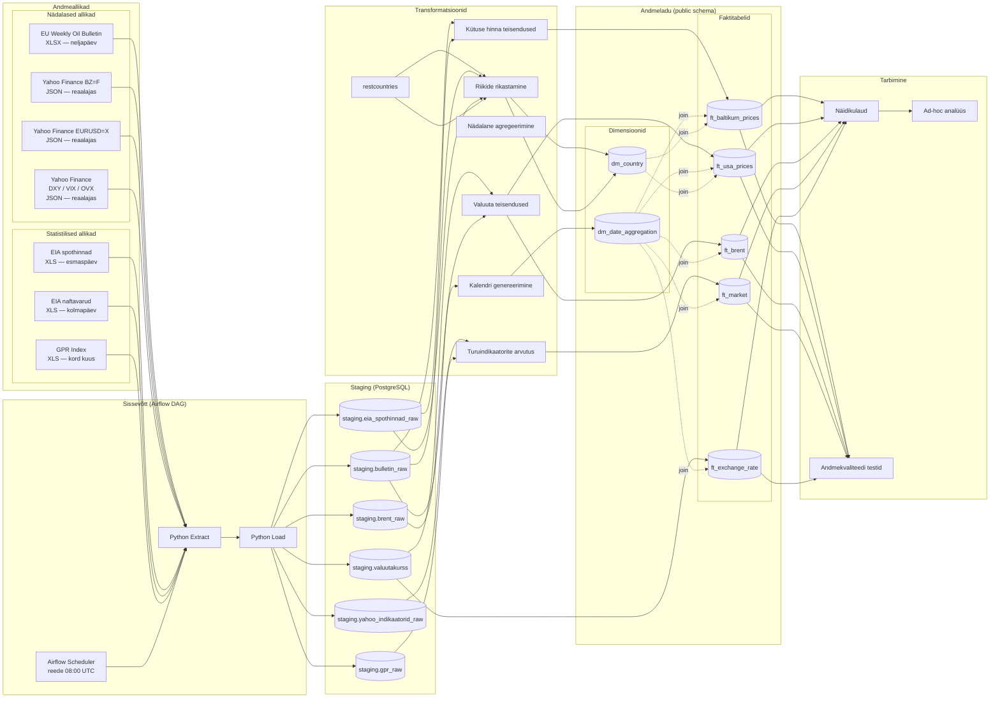

# Kütuseanalüüs — Maailmaturu ja Eesti kütusehindade võrdlev analüüs

## Äriküsimus

Kui kiiresti ja võrdselt kanduvad bensiini/diisli hinnamuutused üle Baltikumi tankla hindadesse ning milline riik pakub igal nädalal odavaima kütuse?

**Mõõdikud:**

1. Maailma bensiini ja Eesti, Läti, Leedu hinnavõrdlus nädala lõikes
2. Maailma diisli ja Eesti, Läti, Leedu hinnavõrdlus nädala lõikes

## Arhitektuur



Täpsem kirjeldus: [`docs/arhitektuur.md`](docs/arhitektuur.md)

## Andmestik

| Allikas | Tüüp | Ajas muutuv? | Roll | Link |
|---------|------|--------------|------|------|
| EU Weekly Oil Bulletin | XLSX | Neljapäeviti | EE/LV/LT Euro95 ja diisel €/l | https://energy.ec.europa.eu/document/download/906e60ca-8b6a-44e7-8589-652854d2fd3f_en?filename=Weekly_Oil_Bulletin_Prices_History_maticni_4web.xlsx |
| Yahoo Finance (BZ=F) | JSON API | Reaalajas | Brent toornafta nädala sulgemishind USD/bbl | https://query1.finance.yahoo.com/v8/finance/chart/BZ%3DF?interval=1wk |
| Yahoo Finance (EURUSD=X) | JSON API | Reaalajas | EUR/USD vahetuskurss | https://query1.finance.yahoo.com/v8/finance/chart/EURUSD%3DX?interval=1wk |
| Yahoo Finance (DX-Y.NYB, ^VIX, ^OVX) | JSON API | Reaalajas | DXY, VIX, OVX indikaatorid | https://query1.finance.yahoo.com/v8/finance/chart/DX-Y.NYB?interval=1wk |
| EIA spothinnad (PET_PRI_SPT_S1_W) | XLS | Esmaspäeviti | US Gulf Coast bensiin ja diisel $/gal | https://www.eia.gov/dnav/pet/xls/PET_PRI_SPT_S1_W.xls |
| EIA naftavarud (WCRSTUS1) | XLS | Kolmapäeviti | USA toornafta nädalased varud (tuh. bbl) | https://www.eia.gov/dnav/pet/hist_xls/WCRSTUS1w.xls |
| Caldara & Iacoviello GPR | XLS | ~Kord kuus | Geopoliitilise riski päevane indeks | https://www.matteoiacoviello.com/gpr_files/data_gpr_daily_recent.xls |


## Stack

| Komponent | Tööriist |
|-----------|---------|
| Sissevõtt | Python + Apache Airflow |
| Transformatsioon | Python + SQL |
| Andmehoidla | PostgreSQL |
| Näidikulaud | Superset |
| Orkestreerimine | Airflow |

## Käivitamine

```bash
# 1. Klooni repo ja liigu kausta
git clone https://github.com/godbolts/fuel_analysis.git
cd fuel_analysis

# 2. Kopeeri keskkonnamuutujad
cp env.example .env
# Muuda .env failis paroolid vastavalt vajadusele

# 3. Käivita teenused
docker compose up -d --build


-------------------
# 4. Peata teenused (andmed säilivad)
docker compose down

# Peata teenused ja kustuta kõik andmed (fresh start)
docker compose down -v
```

Airflow: http://localhost:8080 
Näidikulaud: http://localhost:8088

## Saladused ja konfiguratsioon

Kõik saladused (paroolid, API võtmed, andmebaasi URL-id) on `.env` failis. 

Vajalikud muutujad:

| Muutuja | Tähendus | Näide |
|---------|----------|-------|
| `POSTGRES_USER` | Andmebaasi kasutajanimi | `bensiin` |
| `POSTGRES_PASSWORD` | Andmebaasi parool | (saladus) |
| `POSTGRES_DB` | Andmebaasi nimi | `bensiin` |
| `AIRFLOW_USER` | Airflow UI kasutajanimi | `nafta` |
| `AIRFLOW_PASSWORD` | Airflow UI parool | (saladus) |
| `AIRFLOW_DB` | Airflow metaandmebaasi nimi | `nafta` |
| `AIRFLOW__API_AUTH__JWT_SECRET` | JWT allkirja saladus | (saladus) |
| `AIRFLOW_UID` | Airflow konteinerikasutaja UID | `50000` |

## Andmevoog lühidalt

1. **Sissevõtt** — Python (requests + pandas) tõmbab nädalasi andmeid 4 allikast: EU Kütusebulletään, EIA spothinnad ja naftavarud, GPR geopoliitiline riskiindeks, Yahoo Finance (Brent, EUR/USD, DXY, VIX, OVX). Airflow käivitab igal reedel kell 08:00 UTC.
2. **Laadimine** — Andmed laaditakse staging kihti PostgreSQL-is (kokku 7 tabelit). Inkrementaalne, duplikaate ei lisata (ON CONFLICT DO NOTHING).
3. **Transformatsioon** — Toorandmed normaliseeritakse ühtsele nädalasele ajavahemikule (date_trunc('week')::date), hinnad teisendatakse võrreldavatesse ühikutesse (USD/gallon → USD/l ÷ 3.78541, EUR/1000l → EUR/l ÷ 1000, USD → EUR ÷ EUR/USD kurss, USD/barrel → USD/l ÷ 158.987), GPR päevased väärtused agregeeritatakse nädala keskmiseks (AVG), naftavarude nädalane muutus arvutatakse aknafunktsiooniga (LAG), ning dimensioonitabelid (dm_country, dm_date_aggregation) rikastatakse välisandmetega (restcountries.com API, kalendriarvutused).
4. **Testimine** — [Mitu] andmekvaliteedi testi kontrollivad korrektsust
5. **Näidikulaud** — [Kirjelda lühidalt, mida näidikulaud näitab]

## Andmekvaliteedi testid

Projekt kontrollib järgmist:

1. [Test 1 - nt: kasutajate ID on unikaalne]
2. [Test 2 - nt: tellimuse summa pole null]
3. [Test 3 - nt: kuupäev jääb vahemikku 2020-2026]
[Lisa rohkem, kui sul on]

Testide tulemused: [kuhu salvestatakse / kuidas vaadata]

## Projekti struktuur

```
.
├── README.md
├── compose.yml                          ← peamine Docker Compose konfiguratsioon
├── env.example                          ← keskkonnamuutujate näidis (.env põhi)
├── .gitignore
├── staging_tabelid.md                   ← staging skeemi tabelite dokumentatsioon
├── superseti_andmebaasiuhenduse_loomine.md ← juhend Superset DB ühenduse seadistamiseks
├── transform_tables.md                  ← mart-kihis tabelite dokumentatsioon
├── dags/
│   ├── kutuse_hind_pipeline.py          ← ingest DAG (reede 11:00)
│   └── transform_pipeline.py           ← transform DAG (reede 12:00)
├── docs/
│   ├── arhitektuur.md
│   └── progress.md
├── init/                                ← PostgreSQL init skriptid (staging skeemi loomine)
├── superset/                            ← Superset konfiguratsioon ja seadistus
└── transform/
    ├── run_transforms.py                ← orkestreerib kõik transformatsioonid
    └── tables/
        ├── dm_date_aggregation.py
        ├── dm_country.py
        ├── ft_baltikum_prices.py
        ├── ft_usa_prices.py
        ├── ft_brent.py
        ├── ft_market.py
        └── ft_exchange_rate.py
```

## Kokkuvõte, puudused ja võimalikud edasiarendused

**Kokkuvõte:**
- [Loetle, mis on lõpule viidud, mis töötab hästi]

**Puudused:**
- [Loetle ausalt, mis jäi tegemata - see ei mõjuta hinnet negatiivselt, vaid aitab hinnata]

**Mis edasi:**
- [Mida tahaksid edasi teha, kui aega oleks rohkem]

## Meeskond

| Nimi | Roll |
|------|------|
| Teet Kalmus | Näidikulaua omanik |
| Marko Karilaid | Transformatsioonide omanik |
| Ilmar-Jürgen Rammi | Kvaliteedi omanik |
| Üllar Unt | Andmeallika omanik |
