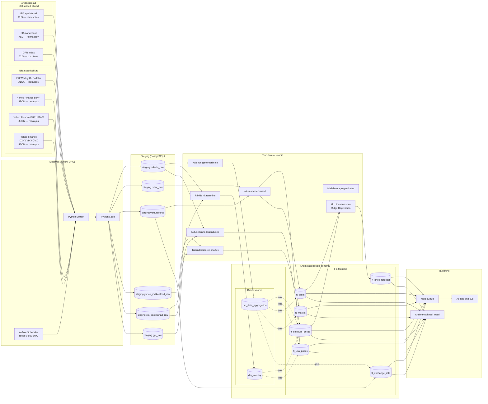

# Baltikumi Kütusehindade Analüüsi Projekt

## Äriküsimus

Kui kiiresti ja võrdselt kanduvad bensiini/diisli hinnamuutused üle Baltikumi tankla hindadesse ning milline riik pakub igal nädalal odavaima kütuse?

**Mõõdikud:**

1. Maailma bensiini ja Eesti, Läti, Leedu hinnavõrdlus nädala lõikes
2. Maailma diisli ja Eesti, Läti, Leedu hinnavõrdlus nädala lõikes

Andmestik on hetkel seatud tõmbama toorandmeid alates 2022. aasta jaanuarist, eesmärgiga hõlmata perioodi alates Ukraina sõja puhkemisest ning näidata sõjajärgset kallinemist ja ebastabiilsemat turgu, mis on kujunenud viimaste aastate reaalsuseks.

Meie põhi-KPI-d on USA ja Baltikumi bensiini ning diisli hinnad, kuid andmestik sisaldab ka palju muid andmepunkte, millega saab edasi arendada keerulisemaid ja dünaamilisemaid analüüse, mis hõlmavad börsi- ja toornaftaturu näitajaid.

---

## Arhitektuur


```mermaid
flowchart LR

    subgraph Sources["Andmeallikad"]
        subgraph Weekly["Nädalased allikad"]
            eu[EU Weekly Oil Bulletin<br/>XLSX — neljapäev]
            yahoo_brent[Yahoo Finance BZ=F<br/>JSON — reaalajas]
            yahoo_fx[Yahoo Finance EURUSD=X<br/>JSON — reaalajas]
            yahoo_ind[Yahoo Finance<br/>DXY / VIX / OVX<br/>JSON — reaalajas]
        end
        subgraph Frequent["Statistilised allikad"]
            eia_spot[EIA spothinnad<br/>XLS — esmaspäev]
            eia_varud[EIA naftavarud<br/>XLS — kolmapäev]
            gpr[GPR Index<br/>XLS — kord kuus]
        end
    end

    subgraph Ingestion["Sissevõtt (Airflow DAG)"]
        scheduler[Airflow Scheduler<br/>reede 08:00 UTC]
        extract[Python Extract]
        load[Python Load]
    end

    subgraph Staging["Staging (PostgreSQL)"]
        bulletin[(staging.bulletin_raw)]
        brent_raw[(staging.brent_raw)]
        fx_raw[(staging.valuutakurss)]
        indicators_raw[(staging.yahoo_indikaatorid_raw)]
        eia_raw[(staging.eia_spothinnad_raw)]
        gpr_raw[(staging.gpr_raw)]
    end

    subgraph Transform["Transformatsioonid"]
        date_gen[Kalendri genereerimine]
        country_gen[Riikide rikastamine]
        weekly_agg[Nädalane agregeerimine]
        currency_calc[Valuuta teisendused]
        fuel_calc[Kütuse hinna teisendused]
        market_calc[Turuindikaatorite arvutus]
        ml_forecast[ML hinnaennustus<br/>Ridge Regression]
    end

    subgraph Warehouse["Andmeladu (public schema)"]
        subgraph Dimensions["Dimensioonid"]
            dm_date[(dm_date_aggregation)]
            dm_country[(dm_country)]
        end
        subgraph Facts["Faktitabelid"]
            ft_baltic[(ft_baltikum_prices)]
            ft_usa[(ft_usa_prices)]
            ft_brent[(ft_brent)]
            ft_market[(ft_market)]
            ft_fx[(ft_exchange_rate)]
            ft_forecast[(ft_price_forecast)]
        end
    end

    subgraph Consumption["Tarbimine"]
        dashboard[Näidikulaud]
        quality[Andmekvaliteedi testid]
        analytics[Ad-hoc analüüs]
    end

    eu --> extract
    yahoo_brent --> extract
    yahoo_fx --> extract
    yahoo_ind --> extract
    eia_spot --> extract
    eia_varud --> extract
    gpr --> extract
    scheduler --> extract
    extract --> load

    load --> bulletin
    load --> brent_raw
    load --> fx_raw
    load --> indicators_raw
    load --> eia_raw
    load --> gpr_raw

    bulletin --> date_gen
    date_gen --> dm_date

    bulletin --> country_gen
    eia_raw --> country_gen
    country_gen --> dm_country

    bulletin --> fuel_calc
    fuel_calc --> ft_baltic

    eia_raw --> fuel_calc
    fx_raw --> currency_calc
    currency_calc --> ft_usa

    brent_raw --> currency_calc
    currency_calc --> ft_brent

    fx_raw --> ft_fx

    indicators_raw --> market_calc
    gpr_raw --> market_calc
    market_calc --> ft_market

    ft_baltic --> ml_forecast
    ft_brent --> ml_forecast
    ml_forecast --> ft_forecast

    dm_date -. join .-> ft_baltic
    dm_date -. join .-> ft_usa
    dm_date -. join .-> ft_brent
    dm_date -. join .-> ft_market
    dm_date -. join .-> ft_fx

    dm_country -. join .-> ft_baltic
    dm_country -. join .-> ft_usa

    ft_baltic --> dashboard
    ft_usa --> dashboard
    ft_brent --> dashboard
    ft_market --> dashboard
    ft_fx --> dashboard
    ft_forecast --> dashboard

    ft_baltic --> quality
    ft_usa --> quality
    ft_brent --> quality
    ft_market --> quality
    ft_fx --> quality
    ft_forecast --> quality

    dashboard --> analytics
```

Täpsem kirjeldus: [`docs/arhitektuur.md`](docs/arhitektuur.md)

---

## Andmestik

| Allikas | Tüüp | Ajas muutuv? | Roll | Link |
|---------|------|--------------|------|------|
| EU Weekly Oil Bulletin | XLSX | Neljapäeviti | EE/LV/LT Euro95 ja diisel €/l | [link](https://energy.ec.europa.eu/document/download/906e60ca-8b6a-44e7-8589-652854d2fd3f_en?filename=Weekly_Oil_Bulletin_Prices_History_maticni_4web.xlsx) |
| Yahoo Finance (BZ=F) | JSON API | Reaalajas | Brent toornafta nädala sulgemishind USD/bbl | [link](https://query1.finance.yahoo.com/v8/finance/chart/BZ%3DF?interval=1wk) |
| Yahoo Finance (EURUSD=X) | JSON API | Reaalajas | EUR/USD vahetuskurss | [link](https://query1.finance.yahoo.com/v8/finance/chart/EURUSD%3DX?interval=1wk) |
| Yahoo Finance (DX-Y.NYB, ^VIX, ^OVX) | JSON API | Reaalajas | DXY, VIX, OVX indikaatorid | [link](https://query1.finance.yahoo.com/v8/finance/chart/DX-Y.NYB?interval=1wk) |
| EIA spothinnad (PET_PRI_SPT_S1_W) | XLS | Esmaspäeviti | US Gulf Coast RBOB Regular Gasoline ja ULSD diisel $/gal | [link](https://www.eia.gov/dnav/pet/xls/PET_PRI_SPT_S1_W.xls) |
| EIA naftavarud (WCRSTUS1) | XLS | Kolmapäeviti | USA toornafta nädalased varud (tuh. bbl) | [link](https://www.eia.gov/dnav/pet/hist_xls/WCRSTUS1w.xls) |
| Caldara & Iacoviello GPR | XLS | ~Kord kuus | Geopoliitilise riski päevane indeks | [link](https://www.matteoiacoviello.com/gpr_files/data_gpr_daily_recent.xls) |

---

## Stack

| Komponent | Tööriist |
|-----------|---------|
| Sissevõtt | Python + Apache Airflow |
| Transformatsioon | Python + SQL |
| Andmehoidla | PostgreSQL / pgduckdb |
| Näidikulaud | Apache Superset |
| Orkestreerimine | Airflow |

---

## Käivitamine

```bash
# 1. Klooni repo ja liigu kausta
git clone https://github.com/godbolts/fuel_analysis.git
cd fuel_analysis

# 2. Kopeeri keskkonnamuutujad
cp env.example .env
# Muuda .env failis paroolid vastavalt vajadusele

# 3. Käivita teenused
docker compose up -d --build

# 4. Peata teenused (andmed säilivad)
docker compose down

# Peata teenused ja kustuta kõik andmed (fresh start)
docker compose down -v
```

Docker tõmbab vajalikud image-id ja ehitab konteinerid üles automaatselt. Esimesel käivitamisel kulub see mõni minut.

Kui logi kirjed hakkavad konstantselt korduma, on programm **idle** olekus — see on normaalne. Kuigi kõik konteinerid on üleval ja tabelid on loodud, on need tühjad, kuna pipeline'id ootavad täpset käivitamisaega (ingest reedeti kell 08:00, transform reedeti kell 09:00).

**Kõige lihtsam viis andmeid kohe laadida** on minna brauseris aadressile `http://localhost:8080`, logida sisse `.env` failis olevate paroolidega ja käivitada DAG-id käsitsi:

1. Logi sisse Airflow UI-sse (`http://localhost:8080`)
2. Vali DAG-ide nimekirjast `kutuse_hind_pipeline`
3. Vajuta ▶ (Trigger DAG) ja oota kuni kõik taskid on rohelised
4. Seejärel käivita samamoodi `kutuse_transform_pipeline`

---

## Saladused ja konfiguratsioon

Kõik saladused (paroolid, API võtmed, andmebaasi URL-id) on `.env` failis.

| Muutuja | Tähendus | Näide |
|---------|----------|-------|
| `POSTGRES_USER` | Andmebaasi kasutajanimi | `bensiin` |
| `POSTGRES_PASSWORD` | Andmebaasi parool | (saladus) |
| `POSTGRES_DB` | Andmebaasi nimi | `bensiin` |
| `AIRFLOW_USER` | Airflow UI kasutajanimi | `nafta` |
| `AIRFLOW_PASSWORD` | Airflow UI parool | (saladus) |
| `AIRFLOW_DB` | Airflow metaandmebaasi nimi | `nafta` |
| `AIRFLOW__API_AUTH__JWT_SECRET` | JWT allkirja saladus | (saladus) |
| `AIRFLOW_UID` | Airflow konteinerikasutaja UID | `50000` |
| `SUPERSET_ADMIN_USER` | Superseti administraatori kasutajanimi | (saladus) |
| `SUPERSET_ADMIN_PASSWORD` | Superseti administraatori parool | (saladus) |
| `SUPERSET_ADMIN_EMAIL` | Superseti administraatori e-post | (saladus) |

---

## Andmevoog lühidalt

1. **Sissevõtt** — Python (requests + pandas) tõmbab nädalasi andmeid 7 allikast: EU kütusebulletään, EIA spothinnad ja naftavarud, GPR geopoliitiline riskiindeks, Yahoo Finance (Brent, EUR/USD, DXY, VIX, OVX). Airflow käivitab igal reedel kell 08:00 UTC.
2. **Laadimine** — Andmed laaditakse staging kihti PostgreSQL-is (kokku 7 tabelit). Inkrementaalne, duplikaate ei lisata (`ON CONFLICT DO NOTHING`).
3. **Transformatsioon** — Toorandmed normaliseeritakse ühtsele nädalasele ajavahemikule (`date_trunc('week')::date`), hinnad teisendatakse võrreldavatesse ühikutesse (USD/gallon → USD/l ÷ 3.78541, EUR/1000l → EUR/l ÷ 1000, USD → EUR ÷ EUR/USD kurss, USD/barrel → USD/l ÷ 158.987), GPR päevased väärtused agregeeritatakse nädala keskmiseks (`AVG`), naftavarude nädalane muutus arvutatakse aknafunktsiooniga (`LAG`), ning dimensioonitabelid (`dm_country`, `dm_date_aggregation`) rikastatakse välisandmetega (restcountries.com API, kalendriarvutused). Puuduvad nädalad täidetakse lineaarse interpolatsiooniga ja märgitakse `is_calculated = TRUE`.
4. **ML hinnaennustus** — Ridge Regression mudel (scikit-learn) ennustab EE tankladiisli hinda 8 nädalat ette. Features: Brent hind 3/4/5 nädalat enne, eelmine hind, 4-nädala libisev keskmine. Tulemused kirjutatakse `public.ft_price_forecast` tabelisse koos 95% usaldusintervalliga (±2×residual_std). Mudeli täpsus: R²≈0.91.
5. **Testimine** — andmekvaliteedi testid kontrollivad andmete täielikkust, korrektsust ja värskust. Kriitilised testid blokeerivad pipeline'i ebaõnnestumise korral.
6. **Näidikulaud** — Superset (`http://localhost:8088`) visualiseerib kütusehindade ajalugu, riikidevahelist võrdlust ja ML ennustust.

---

## Näidikulaud (Superset)

Superset on saadaval aadressil `http://localhost:8088`.

Sisselogimiseks kasuta `.env` failis määratud `SUPERSET_ADMIN_USER` ja `SUPERSET_ADMIN_PASSWORD` väärtusi.

### Andmebaasiühenduse loomine

1. Vali Supersetis **Settings → Database Connections → + Database**
2. Vali andmebaasi tüübiks **PostgreSQL**
3. Täida ühenduse andmed:

| Väli | Väärtus |
|---|---|
| Host | `analytics-db` |
| Port | `5432` |
| Database name | `.env` failist: `POSTGRES_DB` |
| Username | `.env` failist: `POSTGRES_USER` |
| Password | `.env` failist: `POSTGRES_PASSWORD` |

4. Klõpsa **Connect** — edukal ühendusel kuvatakse `Database connected`
5. Vajuta **Finish**

### Dashboardi vaatamine

1. Vali ülemisest menüüst **Dashboards**
2. Klõpsa dashboard'i nimel
3. Dashboard avaneb koos kõigi visualiseeringutega

---

## Andmebaasi struktuur

Andmebaas on jagatud kahte skeemi:

- **`staging`** — toorandmed, laaditud otse allikatest, muutmata kujul
- **`public`** — transformeeritud mart-kihis tabelid, analüüsiks valmis

### Staging tabelid

Täpsem kirjeldus: [`staging_tabelid.md`](Kihtide dukumentatsioon/staging_tabelid.md)

Transformatsioonide filosoofia on, et nad tõmbaksid ainult puuduvaid nädalaid toortabelitest ja teeksid täieliku ülesehitamise ainult siis, kui andmed on kuidagi vigased. Meil tuli ette ka seda, et bulletiinis oli puudu üks nädal Baltikumi hindade kohta ja see inspireeris meid implementeerima lahendust, kus kui andmestikus esineb lünk — üks nädal puudub kahe eksisteeriva nädala vahel — arvutab transformatsioon keskmise ja lisab selle tabelisse. Et seda funktsionaalsust hoida läbipaistvana, sai igasse faktitabelisse lisatud veerg is_calculated, mis näitab, kas tegu on sünteetilise andmepunktiga, ja laseb analüüsis seda veergu ka filtrina kasutada.

| Tabel | Allikas | Kirjeldus |
|---|---|---|
| `staging.bulletin_raw` | EU Weekly Oil Bulletin | EE/LV/LT Euro95 ja diisel €/1000l |
| `staging.brent_raw` | Yahoo Finance BZ=F | Brent toornafta nädala sulgemishind USD/bbl |
| `staging.valuutakurss` | Yahoo Finance EURUSD=X | EUR/USD vahetuskurss |
| `staging.yahoo_indikaatorid_raw` | Yahoo Finance | DXY, VIX, OVX indikaatorid |
| `staging.eia_spothinnad_raw` | EIA | US Gulf Coast bensiin ja diisel $/gal |
| `staging.eia_varud_raw` | EIA | USA toornafta varud tuh. bbl |
| `staging.gpr_raw` | Caldara & Iacoviello | Geopoliitilise riski päevane indeks |

### Mart-kihis tabelid

Täpsem kirjeldus: [`transform_tables.md`](Kihtide dukumentatsioon/transform_tables.md)

#### `public.dm_date_aggregation`

Kalendri dimensioonitabel — üks rida iga nädala kohta.

| Veerg | Tüüp | Kirjeldus |
|---|---|---|
| `week_start_date` | DATE | Nädala alguskuupäev, esmaspäev (PK) — join-veerg teiste tabelitega |
| `week_end_date` | DATE | Nädala lõpukuupäev, pühapäev |
| `year` | SMALLINT | Aasta |
| `quarter` | SMALLINT | Kvartal (1–4) |
| `month` | SMALLINT | Kuu number (1–12) |
| `month_name` | VARCHAR(10) | Kuu nimi inglise keeles |
| `week_number` | SMALLINT | ISO nädala number aastas |
| `is_current_week` | BOOLEAN | Kas tegu on käesoleva nädalaga |
| `add_timestamp` | TIMESTAMPTZ | Viimase upsert-i aeg |

#### `public.dm_country`

Dimensioonitabel kõigi andmestikus esinevate riikide kohta (EE, LV, LT, US).

| Veerg | Tüüp | Kirjeldus |
|---|---|---|
| `country_code_2` | CHAR(2) | Kahetäheline riigikood (PK) — join-veerg teiste tabelitega |
| `country_code_3` | CHAR(3) | Kolmetäheline riigikood |
| `country_name` | VARCHAR(100) | Riigi nimi inglise keeles |
| `capital` | VARCHAR(100) | Pealinna nimi |
| `population` | BIGINT | Rahvaarv |
| `add_timestamp` | TIMESTAMPTZ | Viimase upsert-i aeg |

#### `public.ft_baltikum_prices`

Eesti, Läti ja Leedu iganädalased kütusejaamahinnad eurodes liitri kohta.

| Veerg | Tüüp | Kirjeldus |
|---|---|---|
| `week_start_date` | DATE | Nädala alguskuupäev (PK osa), join `dm_date_aggregation`-ga |
| `country_code` | CHAR(2) | Riigikood EE/LV/LT (PK osa), join `dm_country`-ga |
| `petrol_price` | NUMERIC(6,3) | Euro 95 bensiini hind EUR/l |
| `diesel_price` | NUMERIC(6,3) | Diislikütuse hind EUR/l |
| `is_calculated` | BOOLEAN | TRUE = interpoleeritud lünga täitmiseks, FALSE = päris andmed |
| `add_timestamp` | TIMESTAMPTZ | Kirje lisamise aeg |

#### `public.ft_usa_prices`

USA iganädalased kütuse spothinnad koos varude taseme ja nädalase muutusega.

| Veerg | Tüüp | Kirjeldus |
|---|---|---|
| `week_start_date` | DATE | Nädala alguskuupäev (PK osa), join `dm_date_aggregation`-ga |
| `country_code` | CHAR(2) | Alati `US` (PK osa), join `dm_country`-ga |
| `petrol_usd_l` | NUMERIC(6,4) | Bensiini hind USD/l |
| `diesel_usd_l` | NUMERIC(6,4) | Diisli hind USD/l |
| `petrol_eur_l` | NUMERIC(6,4) | Bensiini hind EUR/l |
| `diesel_eur_l` | NUMERIC(6,4) | Diisli hind EUR/l |
| `eur_usd_rate` | NUMERIC(8,6) | Sel nädalal kasutatud EUR/USD kurss |
| `eia_varud_tuh_bbl` | NUMERIC(12,0) | USA toornafta kaubandusvarud (tuhat bbl) |
| `eia_varud_delta` | NUMERIC(12,0) | Varude muutus eelmise nädalaga (negatiivne = varud vähenesid) |
| `is_calculated` | BOOLEAN | TRUE = interpoleeritud, FALSE = päris andmed |
| `add_timestamp` | TIMESTAMPTZ | Kirje lisamise aeg |

#### `public.ft_brent`

Brent toornafta iganädalane sulgemishind neljas ühikus.

| Veerg | Tüüp | Kirjeldus |
|---|---|---|
| `week_start_date` | DATE | Nädala alguskuupäev (PK), join `dm_date_aggregation`-ga |
| `usd_bbl` | NUMERIC(8,2) | Hind USD/barrel |
| `eur_bbl` | NUMERIC(8,2) | Hind EUR/barrel |
| `usd_l` | NUMERIC(8,4) | Hind USD/liiter |
| `eur_l` | NUMERIC(8,4) | Hind EUR/liiter |
| `eur_usd_rate` | NUMERIC(8,6) | Sel nädalal kasutatud EUR/USD kurss |
| `is_calculated` | BOOLEAN | TRUE = interpoleeritud, FALSE = päris andmed |
| `add_timestamp` | TIMESTAMPTZ | Kirje lisamise aeg |

#### `public.ft_market`

Iganädalased turuindikaatorid — dollari tugevus, volatiilsus ja geopoliitiline risk.

| Veerg | Tüüp | Kirjeldus |
|---|---|---|
| `week_start_date` | DATE | Nädala alguskuupäev (PK), join `dm_date_aggregation`-ga |
| `dollar_index` | NUMERIC(8,4) | USA dollariindeks (DXY) |
| `snp_index` | NUMERIC(8,4) | S&P 500 volatiilsusindeks (VIX) |
| `oil_index` | NUMERIC(8,4) | Nafta volatiilsusindeks (OVX) |
| `gpr_avg` | NUMERIC(10,2) | Geopoliitilise riski nädala keskmine (norm ~100, kriisi ajal >200) |
| `is_calculated` | BOOLEAN | TRUE = interpoleeritud, FALSE = päris andmed |
| `add_timestamp` | TIMESTAMPTZ | Kirje lisamise aeg |

#### `public.ft_exchange_rate`

Iganädalane EUR/USD valuutakurss mõlemas suunas.

| Veerg | Tüüp | Kirjeldus |
|---|---|---|
| `week_start_date` | DATE | Nädala alguskuupäev (PK), join `dm_date_aggregation`-ga |
| `eur_usd` | NUMERIC(8,6) | 1 EUR = X USD |
| `usd_eur` | NUMERIC(8,6) | 1 USD = X EUR |
| `is_calculated` | BOOLEAN | TRUE = interpoleeritud, FALSE = päris andmed |
| `add_timestamp` | TIMESTAMPTZ | Kirje lisamise aeg |

### Tabelite seosed

```
dm_date_aggregation (week_start_date)
    ├── ft_baltikum_prices.week_start_date
    ├── ft_usa_prices.week_start_date
    ├── ft_brent.week_start_date
    ├── ft_market.week_start_date
    └── ft_exchange_rate.week_start_date

dm_country (country_code_2)
    ├── ft_baltikum_prices.country_code
    └── ft_usa_prices.country_code
```

---

## Andmekvaliteedi testid

Projekt kontrollib järgmist automaatselt pärast iga transformatsiooni:

**Staging testid** (käivituvad kohe pärast laadimist):
1. `staging_*_has_data` — kõik staging tabelid sisaldavad andmeid
2. `bulletin_prices_positive` / `brent_prices_positive` — hinnad on positiivsed
3. `exchange_rate_reasonable` — EUR/USD vahemikus 0.5–2.0
4. `no_future_dates` — staging tabelis ei ole tuleviku kuupäevi
5. `staging_gaps` — tuvastab puuduvad nädalad igas staging tabelis (informatiivselt)

**Mart-kihi testid** (käivituvad pärast transformatsioone):
6. `dm_country_*` — dimensiooni terviklikkus, formaadi korrektsus, null-väärtuste puudumine
7. `recent_data_exists` — viimased andmed pole vanemad kui 10 päeva
8. `ft_price_forecast_has_data` — ML tabelis on nii ajaloolisi kui ennustuse ridu
9. `ft_price_forecast_no_null_forecast` — `forecast_price` ei ole null üheski reas

---

## Projekti struktuur

```
.
├── README.md
├── compose.yml                          ← peamine Docker Compose konfiguratsioon
├── env.example                          ← keskkonnamuutujate näidis (.env põhi)
├── .gitignore
├── staging_tabelid.md                   ← staging skeemi tabelite dokumentatsioon
├── superseti_andmebaasiuhenduse_loomine.md ← juhend Superset DB ühenduse seadistamiseks
├── transform_tables.md                  ← mart-kihis tabelite dokumentatsioon
├── dags/
│   ├── kutuse_hind_pipeline.py          ← ingest DAG (reede 08:00 UTC)
│   └── transform_pipeline.py           ← transform + test DAG (reede 09:00 UTC)
├── docs/
│   ├── arhitektuur.md
│   └── progress.md
├── init/                                ← PostgreSQL init skriptid (staging skeemi loomine)
├── superset/
│   ├── setup_connection.py             ← auto-loob Supersetis DB ühenduse ja datasettid
│   └── dashboard_export.zip            ← impordivalmis Superset dashboard
├── tests/
│   ├── README.md                       ← testide dokumentatsioon
│   └── data_quality_tests.py           ← test funktsioonid
└── transform/
    ├── run_transforms.py               ← orkestreerib kõik transformatsioonid
    └── tables/
        ├── dm_date_aggregation.py
        ├── dm_country.py
        ├── ft_baltikum_prices.py
        ├── ft_usa_prices.py
        ├── ft_brent.py
        ├── ft_market.py
        ├── ft_exchange_rate.py
        └── ft_price_forecast.py        ← ML hinnaennustus (Ridge Regression)
```

---

## Kokkuvõte, puudused ja võimalikud edasiarendused

**Kokkuvõte:**
- Andmete tõmbamine API-dest ja nende inkrementaalselt värskena hoidmine.
- Transformatsioonide käivitamine, töötamine ja töösena hoidmine, mis tagab kiiruse, kvaliteedi ja läbinähtavuse.
- Lihtsasti ja sirgjooneliselt nähtavad ja võrreldavad andmepunktid.
- Hästi töötavad ja kvaliteeti tagavad testid.

**Puudused:**
- Hetkel ei tule pähe, et midagi tegemata jäi, rohkem vaadata kuidas edasi arendada saaks.

**Mis edasi:**
- Masinõppe erinevate andmepunktide ja börsi statistika pealt, millega saaks vähemalt mingigi reaalse ennustuse hindadele.

---

## Meeskond

| Nimi | Roll |
|------|------|
| Teet Kalmus | Näidikulaua omanik |
| Marko Karilaid | Transformatsioonide omanik |
| Ilmar-Jürgen Rammi | Kvaliteedi omanik |
| Üllar Unt | Andmeallika omanik |