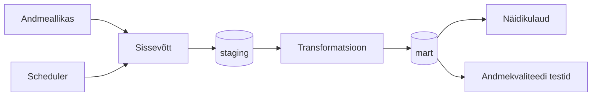

# Arhitektuur

## Äriküsimus

Kui kiiresti ja võrdselt kanduvad bensiini/diisli hinnamuutused üle Baltikumi tankla hindadesse ning milline riik pakub igal nädalal odavaima kütuse?

## Mõõdikud

1. Maailma bensiini ja Eesti, Läti, Leedu hinnavõrdlus nädala lõikes
2. Maailma diisli ja Eesti, Läti, Leedu hinnavõrdlus nädala lõikes

## Andmeallikad

// Üllar ja Teet haldavad potensiaalsed allikaid

| Allikas | Tüüp | Ajas muutuv? | Roll |
|---------|------|--------------|------|
| (https://energy.ec.europa.eu/data-and-analysis/weekly-oil-bulletin_en) / EU Weekly Oil Bulletin | (https://energy.ec.europa.eu/document/download/906e60ca-8b6a-44e7-8589-652854d2fd3f_en?filename=Weekly_Oil_Bulletin_Prices_History_maticni_4web.xlsx) | Jah, kod nädalas, nejapäeviti | Euroopa kütuse hindade allikas |
| [Nimi] | https://www.oilpriceapi.com/ | Ei, staatiline | [Milleks kasutatakse?] |

https://www.eia.gov/dnav/pet/pet_pri_spt_s1_w.htm
EUR/USD vahetus: https://query1.finance.yahoo.com/v8/finance/chart/EURUSD%3DX?interval=1wk&range=5y

EIA — Maailmaturu rafineeritud kütuste spothinnad (US Gulf Coast)
   Leht: https://www.eia.gov/dnav/pet/pet_pri_spt_s1_w.htm
   Fail: https://www.eia.gov/dnav/pet/xls/PET_PRI_SPT_S1_W.xls

## Andmevoog

/Esmase Mustandi võib Marko teha

> Täpsusta diagrammi vastavalt oma projektile — lisa rohkem andmeallikaid, mudeleid või teenuseid.

## Andmebaasi kihid

| Kiht | Roll |
|------|------|
| `staging` | Hoiab allika andmeid töötlemata kujul. |
| `mart` | Hoiab transformeeritud ja ärilogikat sisaldavaid tabeleid. |

## Tööjaotus

| Roll | Vastutus | Täitja |
|------|----------|--------|
| Andmeallika omanik | Kirjutab sissevõtu loogika, hoiab API-t töös | Üllar |
| Transformatsioonide omanik | Kirjutab mart kihi mudelid ja mõõdikute arvutuse | Marko |
| Kvaliteedi omanik | Kirjutab testid ja vaatab läbi ebaõnnestunud kontrollid | Jürgen |
| Näidikulaua omanik | Ehitab näidikulaua ja seob selle äriküsimusega | Teet |

## Riskid

| Risk | Mõju | Maandus |
|------|------|---------|
| API ei vasta | Andmed ei uuene | Programmeerime töövoo teatud aja tagant uuesti proovima. Logime API ühenduse katsed. Kui on pikem katkestus, siis saadame teate. |
| Andmeallika failis on muudatus andmestruktuuris | Võib lõhkuda töövoo, kui sobivat välja päring ei leia. | Testime andmeallika väljade kattuvust. Logime tulemused. Saadame teate, kui töövoog katkeb. |
| Andmeallika failis on andmed puudu | Andmed ei uuene või näitavad valesid tulemusi. | Testime andmete kvaliteeti. Logime tulemused. Saadame teate vigade korral. |

## Privaatsus ja turve

[Kirjelda, millised isiku- või tundlikud andmed teie projektis esinevad (kui üldse) ja kuidas neid kaitsete. Isikuandmed peavad olema anonümiseeritud. Andmebaasi paroolid peavad tulema `.env` failist.]
