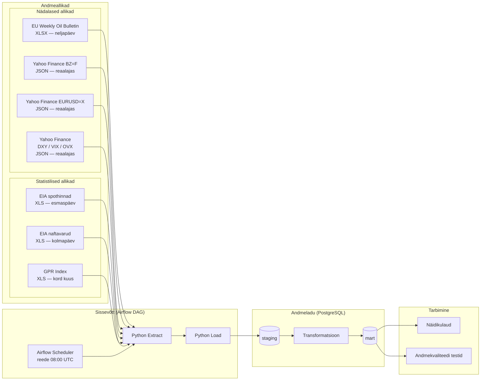

# Arhitektuur

## Äriküsimus

Kui kiiresti ja võrdselt kanduvad bensiini/diisli hinnamuutused üle Baltikumi tankla hindadesse ning milline riik pakub igal nädalal odavaima kütuse?

## Mõõdikud

1. Maailma bensiini ja Eesti, Läti, Leedu hinnavõrdlus nädala lõikes
2. Maailma diisli ja Eesti, Läti, Leedu hinnavõrdlus nädala lõikes

## Andmeallikad

| Allikas | Tüüp | Ajas muutuv? | Roll | Link |
|---------|------|--------------|------|------|
| EU Weekly Oil Bulletin | XLSX | Neljapäeviti | EE/LV/LT Euro95 ja diisel €/l | https://energy.ec.europa.eu/document/download/906e60ca-8b6a-44e7-8589-652854d2fd3f_en?filename=Weekly_Oil_Bulletin_Prices_History_maticni_4web.xlsx |
| Yahoo Finance (BZ=F) | JSON API | Reaalajas | Brent toornafta nädala sulgemishind USD/bbl | https://query1.finance.yahoo.com/v8/finance/chart/BZ%3DF?interval=1wk |
| Yahoo Finance (EURUSD=X) | JSON API | Reaalajas | EUR/USD vahetuskurss | https://query1.finance.yahoo.com/v8/finance/chart/EURUSD%3DX?interval=1wk |
| Yahoo Finance (DX-Y.NYB, ^VIX, ^OVX) | JSON API | Reaalajas | DXY, VIX, OVX indikaatorid | https://query1.finance.yahoo.com/v8/finance/chart/DX-Y.NYB?interval=1wk |
| EIA spothinnad (PET_PRI_SPT_S1_W) | XLS | Esmaspäeviti | US Gulf Coast bensiin ja diisel $/gal | https://www.eia.gov/dnav/pet/xls/PET_PRI_SPT_S1_W.xls |
| EIA naftavarud (WCRSTUS1) | XLS | Kolmapäeviti | USA toornafta nädalased varud (tuh. bbl) | https://www.eia.gov/dnav/pet/hist_xls/WCRSTUS1w.xls |
| Caldara & Iacoviello GPR | XLS | ~Kord kuus | Geopoliitilise riski päevane indeks | https://www.matteoiacoviello.com/gpr_files/data_gpr_daily_recent.xls |

## Andmevoog

## Andmebaasi kihid

| Kiht | Roll |
|------|------|
| `staging` | Hoiab allika andmeid töötlemata kujul. |
| `mart` | Hoiab transformeeritud ja ärilogikat sisaldavaid tabeleid. |

## Tööjaotus

| Roll | Vastutus | Täitja |
|------|----------|--------|
| Andmeallika omanik | Kirjutab sissevõtu loogika, hoiab API-t töös | Üllar |
| Transformatsioonide omanik | Kirjutab mart kihi mudelid ja mõõdikute arvutuse | Marko |
| Kvaliteedi omanik | Kirjutab testid ja vaatab läbi ebaõnnestunud kontrollid | Jürgen |
| Näidikulaua omanik | Ehitab näidikulaua ja seob selle äriküsimusega | Teet |

## Riskid

| Risk | Mõju | Maandus |
|------|------|---------|
| API ei vasta | Andmed ei uuene | Programmeerime töövoo teatud aja tagant uuesti proovima. Logime API ühenduse katsed. Kui on pikem katkestus, siis saadame teate. |
| Andmeallika failis on muudatus andmestruktuuris | Võib lõhkuda töövoo, kui sobivat välja päring ei leia. | Testime andmeallika väljade kattuvust. Logime tulemused. Saadame teate, kui töövoog katkeb. |
| Andmeallika failis on andmed puudu | Andmed ei uuene või näitavad valesid tulemusi. | Testime andmete kvaliteeti. Logime tulemused. Saadame teate vigade korral. |

## Privaatsus ja turve

Meie projektis on kasutusel avalikud andmed, ükski andmepunkt ei vaja turvet.
