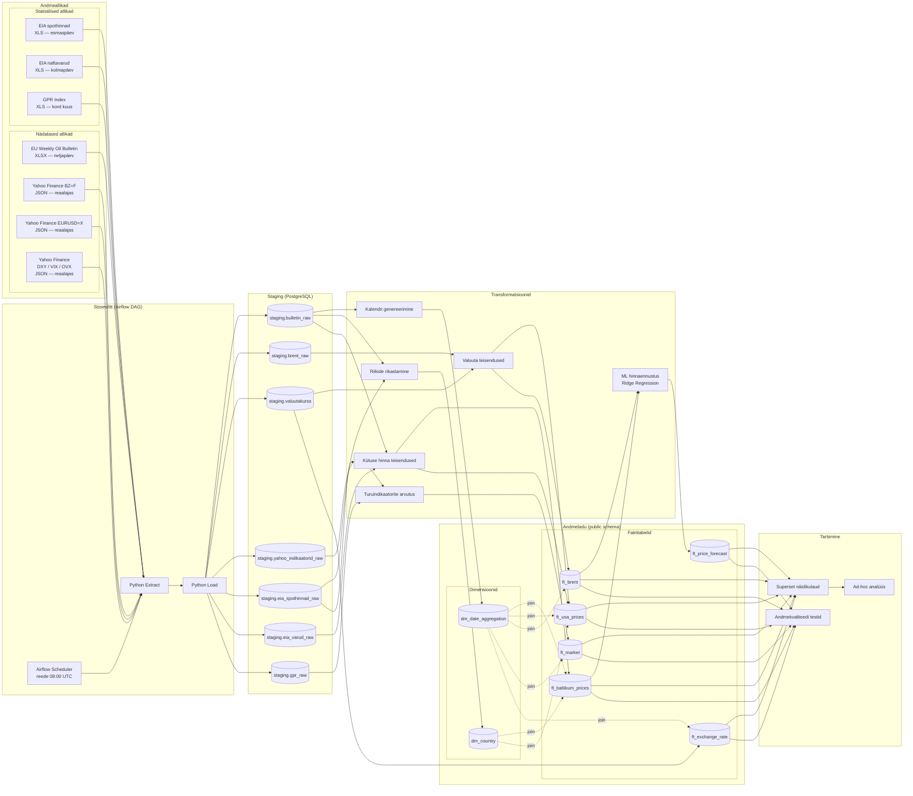

# Arhitektuur

## Äriküsimus

Kui kiiresti ja võrdselt kanduvad bensiini/diisli hinnamuutused üle Baltikumi tankla hindadesse ning milline riik pakub igal nädalal odavaima kütuse?

## Mõõdikud

1. **Bensiini jaehind** - Eesti, Läti, Leedu Euro95 hind EUR/l nädala lõikes, võrdluses USA hulgihinnaga
2. **Diisli jaehind** - Eesti, Läti, Leedu diisli hind EUR/l nädala lõikes, võrdluses USA hulgihinnaga
3. **Keskmine marginaal** - Baltikumi tankla jaehinna ja USA hulgihinna vahe EUR/l; näitab, kui kiiresti maailmaturu hinnamuutused tanklasse jõuavad
4. **ML diislihinnaennustus** - Ridge Regression mudel ennustab EE/LV/LT diisli hinda 8 nädalat ette, kasutades 9 tunnust: Brenti hind 3–5 nädalat tagasi, eelmine tanklahind, 4-nädala libisev keskmine ning turuindikaatorid DXY, VIX, OVX ja GPR

---

## Andmeallikad

| Allikas | Tüüp | Ajas muutuv? | Roll | Link |
|---------|------|--------------|------|------|
| EU Weekly Oil Bulletin | XLSX | Neljapäeviti | EE/LV/LT Euro95 ja diisel €/l | [link](https://energy.ec.europa.eu/document/download/906e60ca-8b6a-44e7-8589-652854d2fd3f_en?filename=Weekly_Oil_Bulletin_Prices_History_maticni_4web.xlsx) |
| Yahoo Finance (BZ=F) | JSON API | Reaalajas | Brent toornafta nädala sulgemishind USD/bbl | [link](https://query1.finance.yahoo.com/v8/finance/chart/BZ%3DF?interval=1wk) |
| Yahoo Finance (EURUSD=X) | JSON API | Reaalajas | EUR/USD vahetuskurss | [link](https://query1.finance.yahoo.com/v8/finance/chart/EURUSD%3DX?interval=1wk) |
| Yahoo Finance (DX-Y.NYB, ^VIX, ^OVX) | JSON API | Reaalajas | DXY, VIX, OVX indikaatorid | [link](https://query1.finance.yahoo.com/v8/finance/chart/DX-Y.NYB?interval=1wk) |
| EIA spothinnad (PET_PRI_SPT_S1_W) | XLS | Esmaspäeviti | US Gulf Coast RBOB Regular Gasoline ja ULSD diisel $/gal | [link](https://www.eia.gov/dnav/pet/xls/PET_PRI_SPT_S1_W.xls) |
| EIA naftavarud (WCRSTUS1) | XLS | Kolmapäeviti | USA toornafta nädalased varud (tuh. bbl) | [link](https://www.eia.gov/dnav/pet/hist_xls/WCRSTUS1w.xls) |
| Caldara & Iacoviello GPR | XLS | ~Kord kuus | Geopoliitilise riski päevane indeks | [link](https://www.matteoiacoviello.com/gpr_files/data_gpr_daily_recent.xls) |

Andmestik tõmbab toorandmeid alates 2022. aasta jaanuarist, eesmärgiga hõlmata perioodi alates Ukraina sõja puhkemisest ning näidata sõjajärgset kallinemist ja ebastabiilsemat turgu, mis on kujunenud viimaste aastate reaalsuseks.

---

## Andmevoog

```mermaid
flowchart LR

    subgraph Sources["Andmeallikad"]
        subgraph Weekly["Nädalased allikad"]
            eu[EU Weekly Oil Bulletin<br/>XLSX — neljapäev]
            yahoo_brent[Yahoo Finance BZ=F<br/>JSON — reaalajas]
            yahoo_fx[Yahoo Finance EURUSD=X<br/>JSON — reaalajas]
            yahoo_ind[Yahoo Finance<br/>DXY / VIX / OVX<br/>JSON — reaalajas]
        end
        subgraph Frequent["Statistilised allikad"]
            eia_spot[EIA spothinnad<br/>XLS — esmaspäev]
            eia_varud[EIA naftavarud<br/>XLS — kolmapäev]
            gpr[GPR Index<br/>XLS — kord kuus]
        end
    end

    subgraph Ingestion["Sissevõtt (Airflow DAG)"]
        scheduler[Airflow Scheduler<br/>reede 08:00 UTC]
        extract[Python Extract]
        load[Python Load]
    end

    subgraph Staging["Staging (PostgreSQL)"]
        bulletin[(staging.bulletin_raw)]
        brent_raw[(staging.brent_raw)]
        fx_raw[(staging.valuutakurss)]
        indicators_raw[(staging.yahoo_indikaatorid_raw)]
        eia_raw[(staging.eia_spothinnad_raw)]
        varud_raw[(staging.eia_varud_raw)]
        gpr_raw[(staging.gpr_raw)]
    end

    subgraph Transform["Transformatsioonid"]
        date_gen[Kalendri genereerimine]
        country_gen[Riikide rikastamine]
        currency_calc[Valuuta teisendused]
        fuel_calc[Kütuse hinna teisendused]
        market_calc[Turuindikaatorite arvutus]
        ml_forecast[ML hinnaennustus<br/>Ridge Regression]
    end

    subgraph Warehouse["Andmeladu (public schema)"]
        subgraph Dimensions["Dimensioonid"]
            dm_date[(dm_date_aggregation)]
            dm_country[(dm_country)]
        end
        subgraph Facts["Faktitabelid"]
            ft_baltic[(ft_baltikum_prices)]
            ft_usa[(ft_usa_prices)]
            ft_brent[(ft_brent)]
            ft_market[(ft_market)]
            ft_fx[(ft_exchange_rate)]
            ft_forecast[(ft_price_forecast)]
        end
    end

    subgraph Consumption["Tarbimine"]
        dashboard[Superset näidikulaud]
        quality[Andmekvaliteedi testid]
        analytics[Ad-hoc analüüs]
    end

    eu --> extract
    yahoo_brent --> extract
    yahoo_fx --> extract
    yahoo_ind --> extract
    eia_spot --> extract
    eia_varud --> extract
    gpr --> extract
    scheduler --> extract
    extract --> load

    load --> bulletin
    load --> brent_raw
    load --> fx_raw
    load --> indicators_raw
    load --> eia_raw
    load --> varud_raw
    load --> gpr_raw

    bulletin --> date_gen
    date_gen --> dm_date

    bulletin --> country_gen
    eia_raw --> country_gen
    country_gen --> dm_country

    bulletin --> fuel_calc
    fuel_calc --> ft_baltic

    eia_raw --> fuel_calc
    varud_raw --> fuel_calc
    fx_raw --> currency_calc
    currency_calc --> ft_usa
    fuel_calc --> ft_usa

    brent_raw --> currency_calc
    currency_calc --> ft_brent

    fx_raw --> ft_fx

    indicators_raw --> market_calc
    gpr_raw --> market_calc
    market_calc --> ft_market

    ft_baltic --> ml_forecast
    ft_brent --> ml_forecast
    ml_forecast --> ft_forecast

    dm_date -. join .-> ft_baltic
    dm_date -. join .-> ft_usa
    dm_date -. join .-> ft_brent
    dm_date -. join .-> ft_market
    dm_date -. join .-> ft_fx
    dm_country -. join .-> ft_baltic
    dm_country -. join .-> ft_usa

    ft_baltic --> dashboard
    ft_usa --> dashboard
    ft_brent --> dashboard
    ft_market --> dashboard
    ft_fx --> dashboard
    ft_forecast --> dashboard
    ft_baltic --> quality
    ft_usa --> quality
    ft_brent --> quality
    ft_market --> quality
    ft_fx --> quality
    ft_forecast --> quality
    dashboard --> analytics
```

---

## Andmebaasi kihid

| Kiht | Roll |
|------|------|
| `staging` | Hoiab allika andmeid töötlemata kujul. Teisendusi ei tehta — andmed on täpselt sellised nagu allikast tulevad. |
| `public` | Hoiab transformeeritud ja ärilogikat sisaldavaid tabeleid. Jagatud dimensioon- ja faktitabeliteks. |

### Staging tabelid

| Tabel | Allikas | Värskendussagedus | Võtmeväljad |
|---|---|---|---|
| `staging.bulletin_raw` | EU Weekly Oil Bulletin | Neljapäeviti | `week_date`, `country`, `euro95_eur_kl`, `diesel_eur_kl` |
| `staging.brent_raw` | Yahoo Finance BZ=F | Reaalajas (nädala close) | `week_date`, `brent_usd_bbl` |
| `staging.valuutakurss` | Yahoo Finance EURUSD=X | Reaalajas (nädala close) | `week_date`, `eur_usd` |
| `staging.yahoo_indikaatorid_raw` | Yahoo Finance | Reaalajas (nädala close) | `week_date`, `dxy`, `vix`, `ovx` |
| `staging.eia_spothinnad_raw` | EIA PET_PRI_SPT_S1_W | Esmaspäeviti (1–2 näd. viivitus) | `week_date`, `bensiin95_usd_gal`, `diisel_usd_gal` |
| `staging.eia_varud_raw` | EIA WCRSTUS1 | Kolmapäeviti | `varud_date`, `eia_varud` |
| `staging.gpr_raw` | Caldara & Iacoviello | ~Kord kuus (päevased väärtused) | `gpr_date`, `gpr` |

### Mart-kihis tabelid

| Tabel | Tüüp | Kirjeldus |
|---|---|---|
| `public.dm_date_aggregation` | Dimensioon | Kalendri dimensioon — üks rida iga nädala kohta alates 2022 |
| `public.dm_country` | Dimensioon | Riigi dimensioon (EE, LV, LT, US) rikastatud restcountries.com API-st |
| `public.ft_baltikum_prices` | Fakt | EE/LV/LT kütuse jaemüügihinnad EUR/l |
| `public.ft_usa_prices` | Fakt | USA kütuse spothinnad USD/l ja EUR/l + naftavarud ja nende nädalane muutus |
| `public.ft_brent` | Fakt | Brent toornafta hind neljas ühikus (USD/bbl, EUR/bbl, USD/l, EUR/l) |
| `public.ft_market` | Fakt | Turuindikaatorid: dollar index, S&P 500 volatiilsus, nafta volatiilsus, GPR |
| `public.ft_exchange_rate` | Fakt | EUR/USD ja USD/EUR kursid |
| `public.ft_price_forecast` | Fakt | ML Ridge Regression ennustus EE diisli hinnale 8 nädalat ette |

---

## Transformatsioonide filosoofia

Transformatsioonid on kirjutatud **inkrementaalse laadimise** põhimõttel — iga jooksmisel laetakse ainult uued read alates viimasest kirjest. Täielik rebuild toimub ainult siis, kui tuvastatakse vana skeem (nt puuduv `is_calculated` veerg).

**Andmelünkade täitmine:** kui staging andmetes esineb puuduv nädal kahe eksisteeriva nädala vahel, arvutab transformatsioon lineaarse interpolatsiooniga vaheväärtuse. Interpolatsioon kasutab ajalise kauguse suhet — puuduv punkt ei saa alati täpset keskmist, vaid kaldub lähema teadaoleva punkti poole. Iga faktitabel sisaldab veergu `is_calculated` (`TRUE` = interpoleeritud, `FALSE` = päris andmed).

**Teisendused:**

| Teisendus | Valem |
|---|---|
| EUR/1000l → EUR/l | `÷ 1000` |
| USD/gallon → USD/l | `÷ 3.78541` |
| USD/barrel → USD/l | `÷ 158.987` |
| USD → EUR | `÷ eur_usd` (join `staging.valuutakurss`-ga) |
| GPR päevane → nädala keskmine | `AVG` üle kõigi päevade nädalas |
| Naftavarude delta | `LAG` aknafunktsioon |

---

## Tehniline stack

| Komponent | Tööriist | Versioon |
|---|---|---|
| Orkestreerimine | Apache Airflow | 3.1.8 |
| Andmehoidla | PostgreSQL + pgduckdb | 18-v1.1.1 |
| Sissevõtt | Python (requests, pandas) | — |
| Transformatsioon | Python + SQL | — |
| ML | scikit-learn Ridge Regression | — |
| Näidikulaud | Apache Superset | — |
| Konteineriseerimine | Docker Compose | — |

### Konteinerid

| Konteiner | Roll |
|---|---|
| `kutus-airflow-api` | Airflow API server ja UI (port 8080) |
| `kutus-airflow-scheduler` | Airflow scheduler — käivitab DAG-id ajakavas |
| `kutus-airflow-dagproc` | Airflow DAG processor — loeb ja parsib DAG faile |
| `kutus-airflow-db` | PostgreSQL — Airflow metaandmebaas |
| `kutus-analytics-db` | PostgreSQL/pgduckdb — analüütikaandmebaas (port 5433) |
| `superset` | Apache Superset näidikulaud (port 8088) |

---

## ML hinnaennustus

Ridge Regression mudel (scikit-learn) ennustab Eesti tankladiisli hinda **8 nädalat ette**.

**Sisendtunnused (features):**
- Brent toornafta hind 3, 4 ja 5 nädalat enne ennustust
- Eelmine EE diisel jaemüügihind
- 4-nädala libisev keskmine EE diisli hinnast

**Väljund:** `public.ft_price_forecast` — sisaldab nii ajaloolisi kui ennustatavaid ridu koos 95% usaldusintervalliga (±2×residual_std).

**Mudeli täpsus:** R²≈0.91

---

## Andmekvaliteedi testid

Testid jooksevad automaatselt pärast iga pipeline'i jooki ja blokeerivad ebaõnnestumise korral järgmised sammud.

**Staging testid:**
- Kõik 7 staging tabelit sisaldavad andmeid
- Kütuse hinnad on positiivsed
- EUR/USD kurss on realistlikus vahemikus (0.5–2.0)
- Staging tabelites pole tuleviku kuupäevi
- Puuduvate nädalate tuvastamine (informatiivselt, ei blokeeri)

**Mart-kihi testid:**
- `dm_country` terviklikkus, formaadi korrektsus, null-väärtuste puudumine
- Viimased andmed pole vanemad kui 10 päeva
- ML prognooside olemasolu ja täielikkus

---

## Tööjaotus

| Roll | Vastutus | Täitja |
|---|---|---|
| Andmeallika omanik | Kirjutab sissevõtu loogika, hoiab API-t töös | Üllar |
| Transformatsioonide omanik | Kirjutab mart-kihi mudelid ja mõõdikute arvutuse | Marko |
| Kvaliteedi omanik | Kirjutab testid ja vaatab läbi ebaõnnestunud kontrollid | Jürgen |
| Näidikulaua omanik | Ehitab näidikulaua ja seob selle äriküsimusega | Teet |

---

## Riskid

| Risk | Mõju | Maandus |
|---|---|---|
| API ei vasta | Andmed ei uuene | Airflow retry loogika (3 katset, 5 min vahe). Ebaõnnestumised logitakse ja märgitakse DAG run-is. |
| Andmeallika failis muutub struktuur | Võib lõhkuda töövoo | Testime väljade kattuvust staging laadimise ajal. Logime tulemused. |
| Andmed puuduvad allikast | Andmed ei uuene või näitavad valesid tulemusi | Andmekvaliteedi testid tuvastavad puuduvad nädalad. Interpolatsioon täidab lüngad automaatselt. |
| EIA avaldab andmeid viivitusega | Staging andmed pole päris ajakohased | Normaalne käitumine — EIA viivitus on 1–2 nädalat, see ei ole viga. |
| GPR uueneb harva | GPR andmed võivad olla mitme nädala vanused | GPR on päevane indeks, mis agregeeritatakse nädalaks — harv uuendus ei mõjuta ajaloolisi väärtusi. |

---

## Privaatsus ja turve

Projektis on kasutusel ainult avalikud andmed — ükski andmepunkt ei sisalda isikuandmeid ega vaja eraldi turvet. Kõik ühenduse paroolid ja saladused hoitakse `.env` failis, mis on `.gitignore`-ga versioonihaldusest välja jäetud.
